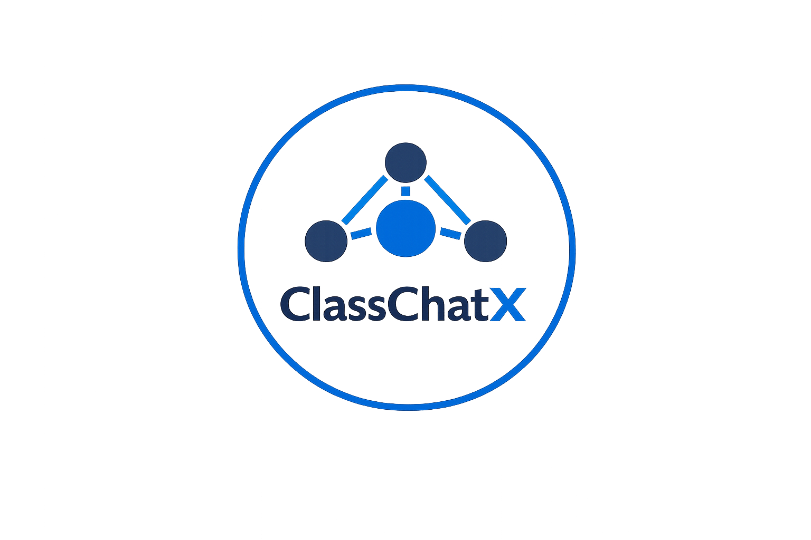

<<<<<<< HEAD

  

# ClassChatX

**ClassChatX** is a TCP-based client–server chat system designed for academic communication.
It allows multiple students to communicate with each other through a centralized server using
socket programming.

## Features
- TCP client–server communication
- Multi-client support
- Client-to-client messaging via server
- JSON-based message protocol
- Command-line interface
- Robust client management

## Technologies Used
- Python 3
- TCP/IP
- Socket Programming
- Threading
- JSON
=======
# ClassChatX-TCP-Chat-System
A TCP-based client–server chat system for academic communication using socket programming.
>>>>>>> 47ede2d2c2344bde492ba487e957033070744990
