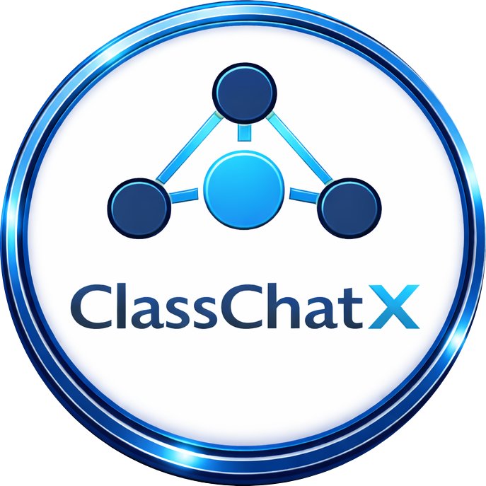

<p align="center">
  
</p>

<h1 align="center">ClassChatX</h1>

<p align="center">
  <strong>TCP-Based Client–Server Chat System</strong><br>
  Academic Communication Platform using Python Socket Programming
</p>

---

## 📌 Project Overview

ClassChatX is a TCP-based multi-client chat system developed using Python.  
It enables real-time communication between multiple users through a centralized server using structured JSON messaging.

This project demonstrates practical implementation of:

- TCP socket programming  
- Client–server architecture  
- Multi-threaded server handling  
- Client management system  
- JSON-based communication protocol  
- GUI integration with networking  
- Modular software design principles  

---
<br>

## 🏗 System Architecture

The project follows a modular and layered architecture to ensure scalability and maintainability.

```text
Gnss-rainfall-detection-tinyML/
│
├── README.md
├── assets/
│   └── classchatx-logo.png
│
├── client/
│   ├── client.py
│   ├── client_task01.py
│   ├── client_task02.py
│   ├── client_task03.py
│   ├── network_client.py
│   └── ui_client.py
│
├── server/
│   ├── server.py
│   ├── server_task01.py
│   ├── server_task02.py
│   └── server_task03.py
│
└──ui/
    └── ui_client.py

---
<br>

### Architecture Layers

Server Layer:
- Accepts multiple TCP client connections  
- Maintains active client registry  
- Forwards messages between clients  
- Handles errors and disconnections  

Network Layer:
- Manages socket communication  
- Sends and receives JSON messages  
- Handles buffering and message framing  

UI Layer:
- Provides user interaction  
- Displays chat messages  
- Collects receiver and message input  
- Maintains branding and layout  

Assets Layer:
- Stores logo and visual resources  

---
<br>

## 🚀 Key Features

- Multi-client TCP communication   
- Client-to-client message forwarding  
- Duplicate username prevention  
- Error handling for unavailable users  
- Thread-safe server implementation  
- GUI-based client interface (Tkinter)  
- Professional modular architecture  

---
<br>

## 🧠 Communication Protocol

All messages between client and server are transmitted using JSON format.

Message Types:

- system – Server notifications  
- chat – Client-to-client messages  
- error – Validation or communication errors  

---
<br>

## ⚙️ Installation & Setup

1. Clone the Repository

```text
git clone https://github.com/DewmikaSenarathna/ClassChatX-TCP-Chat-System.git 
cd ClassChatX-TCP-Chat-System  
```

2. Install Required Dependencies

```text
pip install pillow  
```

Pillow is required for loading the project logo in the GUI.

---
<br>

## ▶️ Running the Application

Step 1 – Start the Server

```text
python server.py  
```

Keep the server running.

Step 2 – Start the GUI Client

Run from the project root directory:

```text
python ui_client.py
```

Open multiple client windows to simulate real-time communication.

---
<br>

## 💻 User Interface

The GUI includes:

- Professional dark theme  
- Branded login screen with project logo  
- Clean header layout  
- Structured chat display  
- Clear sender identification  
- Error message highlighting  

---
<br>

## 🛡 Robustness & Error Handling

The system ensures reliability through:

- Duplicate username prevention  
- Receiver validation checks  
- Graceful client disconnection handling  
- Thread synchronization for shared resources  
- Controlled socket shutdown  

---
<br>

## 📚 Technologies Used

- Python 3  
- TCP/IP Socket Programming  
- Threading (Concurrency Handling)  
- JSON (Data Serialization)  
- Tkinter (GUI Framework)  
- Pillow (Image Handling)  

---
<br>

## 🎯 Academic Learning Outcomes Covered

This project demonstrates:

- Implementation of TCP socket communication  
- Design of distributed client–server systems  
- Concurrent connection handling using threads  
- JSON-based network protocol design  
- Exception handling in networked systems   
- Modular and scalable project structure  

---
<br>

ClassChatX – Networking Systems Academic Project